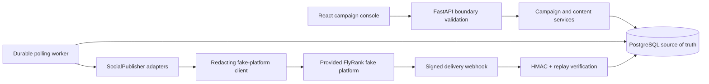

# Relayline Social Studio — Design

## Problem and product

Publishing the same article to multiple social platforms is easy to start and difficult to make reliable. Relayline accepts a blog title, body, URL, and source image; composes distinct Instagram and X posts; produces exact-size assets; stores a schedule; and safely drives each platform post toward verified delivery.

Publishing to real social-media accounts is outside the core capstone. The core targets the FlyRank-provided fake platform only.

## Platform specifications

| Platform | Image | Caption strategy |
| --- | --- | --- |
| Instagram | 1080 × 1080 JPEG (1:1) | Descriptive hook, short context, CTA, restrained hashtags |
| X | 1600 × 900 JPEG (16:9) | Concise summary plus article URL, capped at 280 characters |

Images use orientation-aware EXIF normalization, RGB conversion, centered cover-cropping, deterministic encoding, and deterministic campaign/platform filenames. The centered crop is the documented safe-zone policy: the central subject area remains visible while edge content may be cropped.

## Caption composition

`Shared brand voice + platform rules + normalized article summary → TemplateCaptionGenerator`

The composer owns shared summarization and delegates platform rules to small strategy objects. No paid model or network call is required. A future generator can implement the same protocol without changing campaigns.

## Publishing boundary

`SocialPublisher` is the platform-neutral contract: validate credentials, publish, and parse delivery events. `FakeInstagramPublisher` and `FakeXPublisher` translate that contract into the supplied fake platform's HTTP API through one redacting client. Campaign services never issue raw platform HTTP requests.

## Data model

- `blog_posts`: validated source content and private source-image path.
- `campaigns`: schedule and aggregate status.
- `social_posts`: one unique row per campaign/platform, stable idempotency key, lease/retry state, safe error, and external ID.
- `platform_accounts`: account identity without secrets.
- `oauth_tokens`: AES-GCM ciphertext and nonce, never plaintext.
- `processed_webhooks`: unique event ID and payload digest for replay protection.
- `publish_attempts`: sanitized outcome history for evidence and diagnostics.

## Reliability model

The database is the scheduling source of truth. A worker polls due rows and atomically leases one by transitioning it from `QUEUED`/`RETRY_SCHEDULED` to `PUBLISHING`. Expired `PUBLISHING` leases are recoverable after a process crash. A stable SHA-256 idempotency key derived from `campaign ID + platform` is sent on every attempt. A unique `(campaign_id, platform)` constraint prevents duplicate logical work.

HTTP 429 is not terminal. `Retry-After` accepts delta-seconds and HTTP-date values, is clamped to a bounded range, and moves the row to `RETRY_SCHEDULED`. Network/5xx failures use bounded exponential backoff. Permanent 4xx errors fail without tight retry. Successful publish acknowledgement moves to `AWAITING_DELIVERY`; it does not mean delivered.

## Trust and security

The webhook handler verifies an HMAC-SHA256 signature against the exact raw body before parsing it. A timestamp tolerance limits replay windows, and the event-ID uniqueness constraint makes valid repeats no-ops. Only this verified path can set `PUBLISHED`.

OAuth tokens are sealed with AES-256-GCM. The environment supplies a URL-safe base64 key; each encryption gets a new 96-bit random nonce. The frontend and logs never receive token material, keys, authorization headers, or webhook secrets.

## Layer diagram

The API process creates durable rows. The worker is independently restartable. PostgreSQL coordinates workers through row locking and lease state. Generated images live on a mounted volume and are addressed by opaque API URLs.

