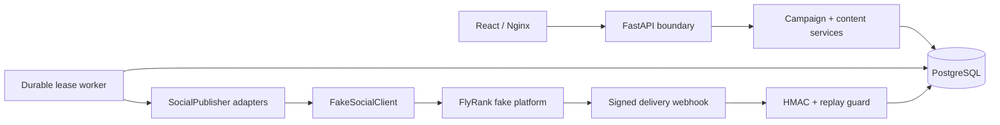

# Relayline Social Studio

Relayline turns one blog post into a durable Instagram-and-X campaign. It creates distinct captions, writes exact-size image assets, stores schedules in PostgreSQL, publishes through platform-neutral adapters, and accepts final delivery state only from a verified webhook.

> **Status:** Tested capstone implementation for local demonstration. The complete fake-platform end-to-end flow remains pending because the course-supplied server is not included in this repository.

The product is deliberately narrow: reliable multi-platform delivery, not a broad marketing suite. Publishing to real social-media accounts is outside the core capstone.

## Supplied fake-platform status

The FlyRank fake social-platform server is required for the complete capstone. It was not included in the attachment or workspace supplied to this repository. Relayline does **not** include a substitute and does not claim real fake-platform end-to-end evidence.

Place the provided starter at `starters/challenge-5-social/`, then align the isolated mapping in `backend/app/integrations/fake_social_client.py` and webhook headers/payload with that starter's documented contract. The Compose `full` profile already points to that location.

## What works

- Safe JPEG/PNG/WebP upload with byte limit and Pillow decode verification.
- Deterministic centered cover crops: Instagram 1080×1080 and X 1600×900.
- Shared brand/summary composition with separate Instagram and X rules.
- One durable `social_posts` row per campaign/platform.
- Stable SHA-256 idempotency key reused across every retry.
- PostgreSQL worker claims with `FOR UPDATE SKIP LOCKED` and expiring leases.
- Bounded retry, exponential backoff, and `Retry-After` seconds/HTTP-date parsing.
- HTTP acknowledgement → `AWAITING_DELIVERY`, never directly to `PUBLISHED`.
- HMAC-SHA256 webhook verification, timestamp tolerance, and event replay protection.
- AES-256-GCM token encryption with a fresh 96-bit nonce for every write.
- React campaign dashboard, creation flow, image/caption previews, and retry state.
- Alembic-only production schema creation, seed command, Docker images, and named volumes.

## Architecture



The API persists intent; it does not own timers. The independently restartable worker finds due rows in PostgreSQL, atomically leases one, decrypts only that platform's token, and calls its adapter. If a worker dies, the lease expires and another worker resumes the same row with the same idempotency key.

### Status flow

```text
QUEUED → PUBLISHING → AWAITING_DELIVERY → verified webhook → PUBLISHED
               ↘ RETRY_SCHEDULED ↗                    ↘ FAILED
```

An HTTP 2xx publish acknowledgement records the external ID but does not cross the delivery trust boundary.

## Platform content

| Platform | Generated file | Caption behavior |
| --- | --- | --- |
| Instagram | 1080×1080 JPEG, 1:1 | Descriptive hook, context, CTA, restrained hashtags |
| X | 1600×900 JPEG, 16:9 | Concise summary, retained URL, ≤280 characters |

Both variants use EXIF orientation normalization, RGB conversion, centered LANCZOS cover-cropping, deterministic names, and real encoded files. Platform captions share the same normalized summary and brand voice but use separate rule fragments.

## Database model

- `blog_posts`: source article and private uploaded-image path.
- `campaigns`: aggregate schedule and status.
- `social_posts`: caption, image, durable due/lease state, stable idempotency key, attempts, external ID, safe error, and delivery time.
- `platform_accounts`: non-secret account metadata.
- `oauth_tokens`: AES-GCM ciphertext, nonce, and key version.
- `publish_attempts`: sanitized attempt outcomes.
- `processed_webhooks`: unique event ID and payload digest.

Important constraints include unique `(campaign_id, platform)`, unique `idempotency_key`, unique account/platform identity, unique token/account, unique webhook event ID, and unique post/attempt number.

## API

| Method | Path | Purpose |
| --- | --- | --- |
| `POST` | `/blog-posts` | Multipart article and validated source image |
| `GET` | `/blog-posts` | List sources |
| `GET` | `/blog-posts/{id}` | Read a source |
| `POST` | `/campaigns` | Compose assets/posts and persist schedule |
| `GET` | `/campaigns` | List campaigns |
| `GET` | `/campaigns/{id}` | Campaign and per-platform state |
| `POST` | `/campaigns/{id}/publish` | Idempotently make queued rows due now |
| `POST` | `/campaigns/{id}/reschedule` | Move an unstarted campaign |
| `POST` | `/platform-accounts` | Store fake-platform token encrypted |
| `GET` | `/platform-accounts` | Return only non-secret metadata |
| `POST` | `/webhook/social-delivery` | Verify and process raw signed event |
| `GET` | `/dashboard` | Dashboard aggregates |
| `GET` | `/health`, `/ready` | Process/database health |

Management endpoints are intentionally unauthenticated for a local capstone demo. Do not expose this build publicly without adding an authorization layer.

## Webhook contract in this repository

Until the supplied server is available for alignment, Relayline expects:

- `X-Social-Timestamp`: Unix seconds.
- `X-Social-Signature`: `sha256=<hex HMAC>`.
- Signed bytes: `timestamp + "." + exact raw request body`.
- JSON: `event_id`, `social_post_id`, `external_post_id`, and `status` (`published` or `failed`).

The signature is checked with constant-time comparison before JSON is trusted. Events outside the configured time tolerance are rejected. A unique event ID makes a repeated valid delivery a safe no-op.

## Setup

Requirements: Docker Desktop with Compose. For host development: Python 3.11+ and Node 20+.

1. Copy the environment template.

   ```powershell
   Copy-Item .env.example .env
   ```

2. Generate an encryption key and place it in `.env`.

   ```powershell
   python -c "import base64,secrets; print(base64.urlsafe_b64encode(secrets.token_bytes(32)).decode())"
   ```

3. Set a separate random `SOCIAL_WEBHOOK_SECRET` in `.env`.

4. Start the available core stack.

   ```powershell
   docker compose up --build
   ```

5. Seed a source, encrypted fake credentials, and a future campaign.

   ```powershell
   docker compose run --rm api python -m app.seed
   ```

6. Open:

   - Frontend: [http://localhost:5173](http://localhost:5173)
   - Backend: [http://localhost:8000](http://localhost:8000)
   - Swagger: [http://localhost:8000/docs](http://localhost:8000/docs)

The database schema is migrated automatically when the API container starts. The explicit command is:

```powershell
docker compose run --rm api alembic upgrade head
```

### Full supplied-server stack

After placing the FlyRank starter at `starters/challenge-5-social/`:

```powershell
docker compose --profile full up --build
```

The exact adapter endpoint/body and webhook contract must be checked against the supplied starter before this is called verified.

## Host development

```powershell
python -m venv .venv
.\.venv\Scripts\python -m pip install -r backend\requirements.txt
Set-Location backend
..\.venv\Scripts\alembic upgrade head
..\.venv\Scripts\uvicorn app.main:app --reload
```

In another terminal:

```powershell
Set-Location frontend
npm install
npm run dev
```

Vite proxies `/api` and `/media` to `127.0.0.1:8000`.

## Testing

Host:

```powershell
Set-Location backend
..\.venv\Scripts\python -m pytest -q
```

Containerized:

```powershell
docker compose run --rm api pytest -q
npm --prefix frontend run build
```

The deterministic suite covers image dimensions/formats, caption divergence/fragments, encryption/nonces/plaintext absence, uniqueness constraints, duplicate publish safety, timeout retry with stable keys, 429 delay, HTTP-date parsing, bounded retries, expired-lease recovery, forged/modified webhooks, valid delivery, replay safety, and clean migration to head.

## Demo sequence

1. Seed, open the dashboard, and select the queued campaign.
2. Compare the square Instagram file and wide X file plus visibly different captions.
3. Create a new campaign with the upload form and schedule it.
4. Click **Publish now** repeatedly; the same logical rows and keys remain.
5. Run the 429, timeout, crash recovery, forged webhook, valid webhook, replay, and encryption tests:

   ```powershell
   Set-Location backend
   ..\.venv\Scripts\python -m pytest -q tests/test_publishing.py tests/test_webhooks.py tests/test_encryption.py
   ```

6. With the supplied fake server installed, repeat those cases through its own simulation controls and inspect its external post list. That last integration step cannot be truthfully demonstrated from the materials currently present.

## Persistence check

PostgreSQL uses the named `postgres-data` volume and generated assets use `campaign-media`.

```powershell
docker compose down
docker compose up -d
docker compose exec -T db psql -U social_studio -d social_studio -c "select count(*) from campaigns;"
```

Do not add `-v` when testing persistence.

## Environment variables

| Variable | Required | Purpose |
| --- | --- | --- |
| `DATABASE_URL` | yes | SQLAlchemy PostgreSQL URL |
| `TOKEN_ENCRYPTION_KEY` | yes | URL-safe base64 encoding of exactly 32 random bytes |
| `SOCIAL_WEBHOOK_SECRET` | yes | HMAC delivery secret |
| `FAKE_SOCIAL_BASE_URL` | yes for publishing | Supplied fake server base URL |
| `FRONTEND_ORIGIN` | yes | Browser CORS origin |
| `MAX_PUBLISH_ATTEMPTS` | no | Bounded attempts, default 4 |
| `WORKER_POLL_SECONDS` | no | Durable queue poll interval |
| `PUBLISH_LEASE_SECONDS` | no | Crash-recovery lease duration |
| `API_PORT`, `FRONTEND_PORT`, `DB_PORT` | no | Host Compose port overrides |

## Limitations

- The supplied FlyRank fake platform is missing, so its OAuth shape, exact publish route, timeout simulation, 429 control, callback signature, and external post-count probes are not verified.
- Management authentication is intentionally omitted for the local demonstration.
- Generated files use a Docker volume/local filesystem, suitable for this single-host capstone rather than a multi-host deployment.
- Caption generation is deterministic template logic; no LLM cost tracking is needed.

## Future work

After every supplied-server probe passes, the most useful extension is an approval workflow (`DRAFT → APPROVED → SCHEDULED`) rather than additional platforms. Real Instagram/X publishing remains outside the core project.

See [DESIGN.md](DESIGN.md), [BUILDLOG.md](BUILDLOG.md), and [EVIDENCE.md](EVIDENCE.md) for design rationale, honest development history, and verified outputs.
